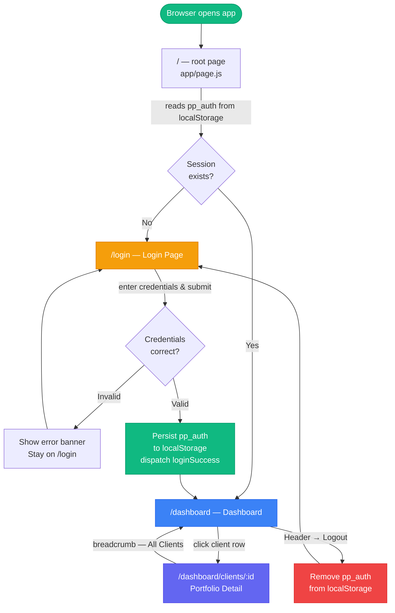
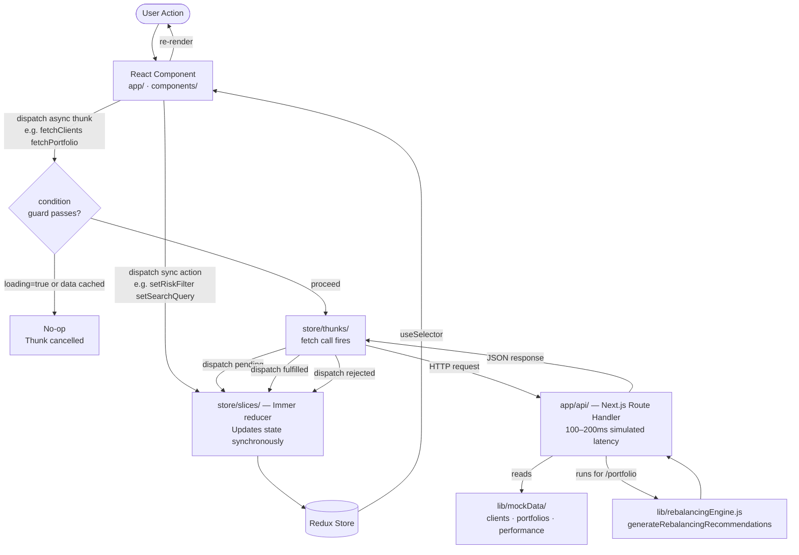
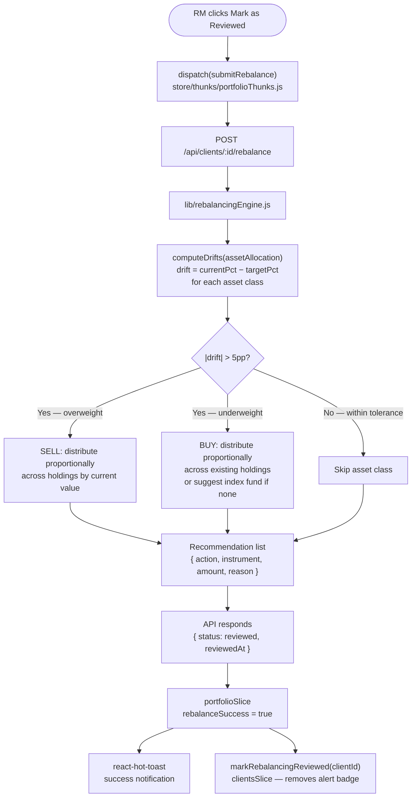

# Portfolio Pulse — Wealth Management Dashboard

An internal web application for Relationship Managers (RMs) at a private wealth management firm. Built as a frontend engineering case study demonstrating production-grade architecture, deliberate component design, and thoughtful UX decisions aligned with an RM's daily workflow.

---

## Prerequisites

| Requirement | Version |
|---|---|
| Node.js | 18.17+ |
| npm | 9+ |

---

## Quick Start

```bash
npm install
npm run dev
# Open http://localhost:3000
```

**Demo credentials**
```
Email:    rm@portfoliopulse.in
Password: Welcome@123
```

---

## Feature Coverage

| Requirement | Status | Notes |
|---|---|---|
| Client portfolio overview (name, ID, AUM, returns, risk, alerts) | ✅ | |
| Sorting by AUM, return %, risk profile | ✅ | |
| Filtering by risk profile + full-text search | ✅ | Search covers name, client ID, city |
| Portfolio detail — donut chart, current vs target allocation | ✅ | |
| Holdings table — instrument, value, gain/loss INR & %, weight | ✅ | |
| 6-month performance chart vs Nifty 50 benchmark | ✅ | |
| Rebalancing engine — 5pp drift threshold | ✅ | Pure function, independently testable |
| Rebalancing recommendation panel (buy/sell per instrument) | ✅ | |
| "Mark as reviewed" button | ✅ | Updates Redux + mock API |
| `GET /api/clients` | ✅ | |
| `GET /api/clients/:id/portfolio` | ✅ | Recommendations computed server-side |
| `GET /api/clients/:id/performance` | ✅ | |
| `POST /api/clients/:id/rebalance` | ✅ | |
| Realistic Indian mock data | ✅ | 6 HNI clients, 60+ holdings |

### Stretch Goals

| Goal | Status |
|---|---|
| Dark mode with localStorage persistence | ✅ |
| CSV export of holdings table | ✅ |
| Login screen with hardcoded credentials | ✅ |
| Responsive layout for tablet (768px+) | ✅ |
| Unit tests for rebalancing engine | ❌ — see Trade-offs |

---

## Screen Flow



---

## Data Flow

### Redux Data Flow



### Rebalancing Engine Flow



---

## Tech Stack

| Concern | Choice | Rationale |
|---|---|---|
| Framework | Next.js 16 (App Router) | API routes co-located with the app; layout-based auth guard; no separate backend repo needed |
| Language | TypeScript 6 (strict mode) | Full static typing across all source files — see Commit History for migration notes |
| State | Redux Toolkit + Thunk | Three slices with clear cross-component sharing. Thunk is sufficient for async fetch; no need for Saga. RTK's `createAsyncThunk` with `condition` option prevents duplicate in-flight requests |
| Charts | Recharts | Declarative and composable — `PieChart` + `LineChart` needed, both well-supported. Lighter than D3 for standard chart types; easier to theme than Chart.js |
| Styling | Tailwind CSS v4 | Utility-first; dark mode via `@custom-variant` (not `tailwind.config.js`); no runtime CSS-in-JS |
| Animations | CSS `@keyframes` + CSS variables | No animation library; staggered row entrance via `--row-delay` CSS variable per row |
| Toasts | react-hot-toast | Minimal, accessible, zero config |

---

## Project Structure

```
neo-dashboard/
├── app/
│   ├── api/clients/                # Mock REST API — Next.js Route Handlers
│   │   ├── route.ts                # GET /api/clients
│   │   └── [id]/
│   │       ├── portfolio/route.ts  # GET /api/clients/:id/portfolio
│   │       ├── performance/route.ts# GET /api/clients/:id/performance
│   │       └── rebalance/route.ts  # POST /api/clients/:id/rebalance
│   ├── (auth)/login/page.tsx       # Auth route — email/password login with demo credentials
│   ├── dashboard/
│   │   ├── layout.tsx              # Header (shared across all /dashboard/* routes)
│   │   ├── page.tsx                # Client list — SummaryStats + FilterSortBar + ClientsTable
│   │   └── clients/[id]/page.tsx   # Portfolio detail — charts, holdings, rebalancing
│   ├── layout.tsx                  # Root layout — providers, dark mode blocking script, Toaster
│   ├── globals.css                 # Tailwind v4 config, dark mode variant, animation keyframes
│   └── page.tsx                    # Root redirect (/ → /login or /dashboard)
│
├── components/
│   ├── ui/                         # Presentational — no Redux, no side effects
│   │   ├── Icons.tsx               # All SVG icons in one place; imported everywhere
│   │   ├── Input.tsx               # Reusable input (label, error, suffix, forwardRef)
│   │   ├── Button.tsx              # Variants: primary, secondary, ghost, danger
│   │   ├── Badge.tsx               # Risk profile and status badges
│   │   ├── Card.tsx                # Surface container with optional padding
│   │   ├── StatCard.tsx            # KPI card with icon, label, value, sub-value
│   │   ├── LoadingSpinner.tsx      # PageLoader and SectionLoader variants
│   │   ├── EmptyState.tsx          # Empty and error states
│   │   └── ParticleCanvas.tsx      # Canvas particle animation (mouse-interactive)
│   ├── layout/
│   │   └── Header.tsx              # Logo, dark mode toggle, user chip, logout
│   ├── dashboard/                  # Smart — connected to Redux
│   │   ├── SummaryStats.tsx        # 4 KPI cards (AUM, clients, alerts, YTD)
│   │   ├── FilterSortBar.tsx       # Risk filter + debounced search + sort controls
│   │   └── ClientsTable.tsx        # Staggered-animated rows; colour-coded avatars
│   └── portfolio/                  # Smart — connected to Redux
│       ├── AllocationChart.tsx     # Recharts PieChart donut + bar comparison
│       ├── HoldingsTable.tsx       # Sortable holdings table + CSV export
│       ├── PerformanceChart.tsx    # Recharts LineChart vs benchmark
│       └── RebalancingPanel.tsx    # Drift analysis + buy/sell recs + mark reviewed
│
├── store/
│   ├── index.ts                    # Redux store configuration + RootState / AppDispatch types
│   ├── slices/                     # State shape · synchronous reducers · selectors
│   │   ├── authSlice.ts            # Auth state (user, isAuthenticated, loginError)
│   │   ├── clientsSlice.ts         # Items, filters, sort + selectFilteredSortedClients
│   │   └── portfolioSlice.ts       # Portfolio data, performance, rebalance status
│   └── thunks/                     # Async operations · side effects · API calls
│       ├── authThunks.ts           # loginThunk, hydrateAuthThunk, logoutThunk
│       ├── clientsThunks.ts        # fetchClients (with condition guard)
│       └── portfolioThunks.ts      # fetchPortfolio, fetchPerformance, submitRebalance
│
├── lib/
│   ├── constants.ts                # Enums, DRIFT_THRESHOLD, color maps, sort fields
│   ├── formatters.ts               # formatCurrency (INR Cr/L), formatPercentage, formatDate
│   ├── rebalancingEngine.ts        # Pure functions: computeDrifts, generateRecommendations
│   ├── strings.ts                  # All UI text constants — never hardcoded in components
│   ├── auth.ts                     # Session helpers: setUserSession, getUserSession, clear
│   ├── mockData.ts                 # MOCK_CREDENTIALS for demo login
│   └── mockData/
│       ├── clients.ts              # 6 HNI client summaries
│       ├── portfolios.ts           # Full asset allocation + 60+ holdings
│       └── performance.ts          # 6-month indexed returns (Dec 2025 → May 2026)
│
├── types/
│   └── index.ts                    # All domain types: Client, Portfolio, Holding, DriftResult…
│
├── providers/
│   ├── StoreProvider.tsx           # Redux Provider + hydrateAuthThunk on mount
│   └── ThemeProvider.tsx           # Dark mode context — reads/writes pp_theme to localStorage
│
└── hooks/
    └── useAuth.ts                  # Thin hook: exposes user, login, logout from Redux
```

---

## Architecture Decisions

### 1. Smart vs. Presentational Split

`components/ui/` are purely presentational — they accept props and render, with no knowledge of Redux, routing, or fetch calls. Feature components (`components/dashboard/`, `components/portfolio/`) are smart — they connect to the store and handle async state.

- UI components are trivially reusable and testable in isolation
- Smart components are the single point of Redux concern — no prop-drilling
- Swapping the state manager only requires touching smart components

### 2. Redux Slices vs. Thunks Separation

Slices and thunks live in separate folders with clearly distinct responsibilities:

| Folder | Responsibility |
|---|---|
| `store/slices/` | State shape, Immer reducers, selectors, `extraReducers` wiring |
| `store/thunks/` | Async API calls, localStorage side effects, `createAsyncThunk` |

Import pattern enforces intent: dispatching an async operation → import from `store/thunks/`. Reading state or dispatching sync action → import from `store/slices/`. This removes the mental context-switch between Immer reducer code and `fetch()` network code sitting in the same file.

### 3. Centralised Utilities

| File | Purpose |
|---|---|
| `lib/constants.js` | Single source of truth for enums, thresholds, color maps |
| `lib/formatters.js` | All display formatting — `formatCurrency` renders `₹12.5 Cr`, `₹45 L`, raw INR |
| `lib/strings.js` | All UI text — components import from here, never embed string literals |
| `components/ui/Icons.js` | All SVG icons in one file — eliminates copy-pasted inline SVG |

### 4. Rebalancing Engine — Pure Functions

`lib/rebalancingEngine.js` exports four pure functions with zero knowledge of React, Redux, or the API layer:

```js
computeDrifts(assetAllocation)                  // drift, direction, requiresAction per class
requiresRebalancing(assetAllocation)            // true if any class exceeds 5pp threshold
generateRebalancingRecommendations(portfolio)   // proportional buy/sell per instrument
validateAllocation(assetAllocation)             // checks current + target sum to 100
```

**Algorithm:** Overweight classes → proportional sells weighted by holding value. Underweight → proportional buys. No existing holdings in a class → recommends a representative index fund.

### 5. Preventing Duplicate API Calls (React Strict Mode)

React 18 Strict Mode intentionally mounts → unmounts → remounts components in development. Without guards, `useEffect` dispatches run twice.

**Layer 1 — `createAsyncThunk` `condition` option**
```js
condition: (_, { getState }) => {
  const { loading, items } = getState().clients;
  return !loading && items.length === 0;
}
```
`dispatch(thunk())` synchronously fires the `pending` action (setting `loading = true`). The Strict Mode second mount sees `loading = true` and the thunk is cancelled before any network request. The `items.length === 0` check also prevents redundant re-fetches when navigating back.

**Layer 2 — `useRef` guard in dashboard page**
```js
const hasFetched = useRef(false);
useEffect(() => {
  if (hasFetched.current) return;
  hasFetched.current = true;
  dispatch(fetchClients());
}, [dispatch]);
```
Refs persist across the Strict Mode remount cycle, so the second invocation is skipped.

### 6. Dark Mode — Blocking Script (No FOUC)

`ThemeProvider` reads `localStorage` in a `useEffect` which fires after paint — causing a white-flash. The fix is a synchronous blocking `<script>` in `<head>` that runs before React hydration:

```js
// Runs before first paint — eliminates flash of unstyled content
(function(){
  try {
    var t = localStorage.getItem('pp_theme');
    if (t === 'dark' || (t === null && window.matchMedia('(prefers-color-scheme:dark)').matches)) {
      document.documentElement.classList.add('dark');
    }
  } catch(e) {}
})()
```

### 7. State Management — Why Redux

Redux is used for three domains that genuinely need cross-component sharing:

1. **Auth** — needed by `Header`, `DashboardLayout`, and every page's redirect logic
2. **Clients list** — shared between `SummaryStats`, `FilterSortBar`, and `ClientsTable`
3. **Portfolio detail** — shared between `AllocationChart`, `HoldingsTable`, `PerformanceChart`, `RebalancingPanel`

Local `useState` handles ephemeral UI state: HoldingsTable sort, password visibility, button loading. `selectFilteredSortedClients` is a memoised selector that applies filter + search + sort in one pass.

### 8. API Design

Every endpoint returns proper HTTP status codes (`404`, `400`, `405`), adds 100–200ms artificial latency to make loading states visible, and returns consistent envelope shapes: `{ clients }`, `{ portfolio }`, `{ performance }`, `{ status, reviewedAt }`. The `/portfolio` endpoint runs `generateRebalancingRecommendations()` server-side — the client receives pre-computed data, not raw allocation to crunch itself.

### 9. Authentication

Credentials validated in the Redux thunk (no network round-trip). Session stored in `localStorage` under `pp_auth`. `StoreProvider` dispatches `hydrateAuthThunk()` on first mount to rehydrate Redux. `DashboardLayout` is the auth guard — unauthenticated users redirect to `/login`.

---

## Advanced React Patterns & Optimisations

### 1. Search Debouncing + `useTransition` (FilterSortBar)

The search input uses two complementary techniques to stay responsive while filtering:

```
User types → setInputValue() [immediate — keeps cursor in sync]
           → 250ms debounce timer resets
           → after 250ms: startTransition(() => dispatch(setSearchQuery()))
```

**Why debounce?** Prevents dispatching on every keystroke. With 6 clients it is trivial; with 10,000 it becomes critical — the server query would otherwise fire on every character.

**Why `useTransition`?** Marks the Redux dispatch + filter re-render as a non-urgent (interruptible) update. If the user types again before the transition completes, React cancels the in-progress filter render and starts fresh with the new value. The input field itself always updates immediately regardless.

```js
const [inputValue, setInputValue] = useState('');
const [isPending, startTransition] = useTransition();
const debounceRef = useRef(null);

const handleSearch = useCallback((value) => {
  setInputValue(value);                        // immediate
  clearTimeout(debounceRef.current);
  debounceRef.current = setTimeout(() => {
    startTransition(() => {                    // deferred + interruptible
      dispatch(setSearchQuery(value));
    });
  }, 250);
}, [dispatch]);
```

`isPending` dims the input and shows a small pulse indicator while the transition is in progress, giving the user subtle feedback that filtering is running.

### 2. `createAsyncThunk` Condition Guard

Instead of letting the calling component decide whether to skip a fetch, the guard lives inside the thunk itself. This means the protection works regardless of how many components dispatch the same thunk:

```js
// store/thunks/clientsThunks.js
condition: (_, { getState }) => {
  const { loading, items } = getState().clients;
  return !loading && items.length === 0;
  // loading=true  → a fetch is already in flight, skip
  // items.length  → data is cached, no need to re-fetch
}
```

### 3. `useRef` Fetch Guard (Dashboard Page)

A ref persists across React Strict Mode's intentional remount cycle, unlike a `useState` or an in-module variable:

```js
const hasFetched = useRef(false);
useEffect(() => {
  if (hasFetched.current) return;
  hasFetched.current = true;
  dispatch(fetchClients());
}, [dispatch]);
// dispatch is stable — this effect genuinely only runs once per component instance
```

When the component unmounts (navigation away) and remounts (navigation back), it creates a new instance with `hasFetched.current = false` — but the `condition` in the thunk skips re-fetching since `items.length > 0`.

### 4. Staggered CSS Animations via CSS Variable

Table rows animate in with a stagger delay using a CSS custom property (`--row-delay`) set per row as an inline style. This avoids JavaScript animation libraries entirely:

```jsx
// ClientsTable.js
<tr
  className="row-animate"
  style={{ '--row-delay': `${index * 45}ms` }}
>
```

```css
/* globals.css */
.row-animate {
  opacity: 0;
  animation: fadeInUp 0.35s ease-out both;
  animation-delay: var(--row-delay, 0ms);
}
```

### 5. Dark Mode Without Flash (Blocking Script)

Covered in Architecture Decision #6. Key point: `ThemeProvider` still handles toggling and persistence, but the visual initial state is set synchronously by the blocking script before React even starts — the two layers don't conflict because they both write to the same `document.documentElement.classList`.

---

## API Reference

All endpoints are Next.js Route Handlers under `app/api/`.

### `GET /api/clients`

Returns all clients with summary data for the RM.

**Response `200`**
```json
{
  "clients": [
    {
      "id": "c001",
      "clientId": "PP-2021-001",
      "name": "Arjun Mehta",
      "city": "Mumbai",
      "aum": 125000000,
      "returnOneMonth": 2.3,
      "returnYTD": 14.2,
      "riskProfile": "Aggressive",
      "requiresRebalancing": true,
      "joinedAt": "2021-03-15"
    }
  ]
}
```

---

### `GET /api/clients/:id/portfolio`

Returns full portfolio detail including computed rebalancing recommendations.

**Response `200`**
```json
{
  "portfolio": {
    "client": { "id": "c001", "name": "Arjun Mehta", ... },
    "totalValue": 125000000,
    "lastRebalancedAt": "2025-11-20",
    "rebalancingStatus": "pending",
    "assetAllocation": [
      { "assetClass": "Equities", "currentPct": 67, "targetPct": 60 }
    ],
    "holdings": [
      {
        "id": "h001", "instrumentName": "Reliance Industries",
        "ticker": "RELIANCE", "assetClass": "Equities",
        "currentValue": 5200000, "gainLoss": 420000,
        "gainLossPct": 8.8, "weightPct": 4.16
      }
    ],
    "recommendations": [
      {
        "id": "rec-h001", "action": "SELL",
        "instrumentName": "Reliance Industries",
        "amount": 875000,
        "reason": "Equities overweight by 7.0pp (target 60%, current 67%)"
      }
    ]
  }
}
```

**Response `404`** — unknown client ID

---

### `GET /api/clients/:id/performance`

Returns 6-month performance data indexed to 100 at the start date.

**Response `200`**
```json
{
  "performance": [
    { "month": "Dec '25", "date": "2025-12-01", "portfolio": 100.0, "benchmark": 100.0 },
    { "month": "Jan '26", "date": "2026-01-01", "portfolio": 102.3, "benchmark": 101.1 }
  ]
}
```

---

### `POST /api/clients/:id/rebalance`

Marks a rebalance as reviewed. Updates the portfolio status in memory.

**Request body**
```json
{ "recommendations": [ { "id": "rec-h001", "action": "SELL", "amount": 875000 } ] }
```

**Response `200`**
```json
{ "status": "reviewed", "reviewedAt": "2026-06-10T09:45:00.000Z" }
```

**Response `400`** — missing or empty recommendations array  
**Response `405`** — wrong HTTP method

---

## localStorage Keys

| Key | Value | Set by | Purpose |
|---|---|---|---|
| `pp_auth` | JSON session object | `authThunks.loginThunk` | Persists auth session across page reloads |
| `pp_theme` | `"dark"` or `"light"` | `ThemeProvider.toggleTheme` | Persists dark mode preference |

Both keys are cleared on logout. Neither contains sensitive data — `pp_auth` holds only the user's name, role, and login timestamp (no password, no token).

---

## Mock Data

**6 HNI Clients — RM: Rahul Verma**

| Client | AUM | Risk | Rebalance Alert |
|---|---|---|---|
| Arjun Mehta | ₹12.5 Cr | Aggressive | Yes — Equities 67% vs 60% target |
| Priya Sharma | ₹8.2 Cr | Moderate | No |
| Rajesh Kapoor | ₹22 Cr | Conservative | Yes — Equities 37% vs 30%, Debt 43% vs 50% |
| Anita Desai | ₹15.7 Cr | Moderate | No |
| Vikram Singh | ₹31 Cr | Aggressive | Yes — Equities 72% vs 65% |
| Sunita Patel | ₹6.5 Cr | Conservative | No |

**Holdings** use real Indian instrument names:
- **Equities:** Reliance Industries, TCS, HDFC Bank, Infosys, Bajaj Finance, ICICI Bank, Maruti Suzuki, Asian Paints, Sun Pharma, Zomato
- **Debt:** GOI Securities (8.33% 2026), SBI Bond Fund, RBI Floating Rate Bond, NHAI Bonds
- **Gold:** SBI Gold ETF, Axis Gold ETF, Sovereign Gold Bonds (2028)
- **Real Estate:** Embassy Office Parks REIT, Mindspace Business Parks REIT, Brookfield India REIT
- **Alternatives:** Motilal Oswal PE Fund, Kotak Special Situations Fund, Mirae Asset Emerging Bluechip

**Performance data:** 6 months (Dec 2025 → May 2026), returns indexed to 100, Nifty 50 as benchmark.

---

## Trade-offs & Known Limitations

### 1. TypeScript — Fully Migrated

The codebase was originally prototyped in JavaScript for speed, then fully migrated to TypeScript in commit 2 (see Commit History). All source files are now `.ts`/`.tsx` with `strict: true` — zero `any` escapes except where Recharts' incomplete third-party types require a single `as unknown` cast.

### 2. Client-side auth

`localStorage` auth is acceptable for this demo. Production would use `httpOnly` cookies with a server-issued JWT and Next.js Middleware (`middleware.js`) for edge-level route protection.

### 3. No pagination

The client table renders all records in memory. With more data, this is the first thing to fix — see the 10,000 records section.

### 4. Rebalance state is not persistent

Marking a rebalance as reviewed updates Redux and the mock API responds `200`, but the in-memory mock data resets on server restart. Production would write to a database with a transaction log.

### 5. No unit tests

The rebalancing engine (`lib/rebalancingEngine.ts`) consists entirely of pure functions and is the ideal first test target. Given the time constraint it was skipped. See "What I'd Build Next."

### 6. Recharts SSR

Recharts does not support SSR. All chart components carry `'use client'`. In production, `next/dynamic` with `ssr: false` would reduce the initial bundle size by deferring chart code to a separate chunk.

---

## If This Were a Real Product With 10,000 Client Records

*This is the key question the case study asks directly.*

**What breaks first:** `GET /api/clients` returning all 10,000 records in one response. The browser receives ~2–4 MB of JSON, parses it, and the table freezes on low-end hardware.

**Fixes, in order of impact:**

1. **Server-side pagination** — `GET /api/clients?page=2&pageSize=50&sort=aum&order=desc`. Redux slice tracks `{ page, totalPages, items }`.

2. **Server-side filtering and search** — Move filter/search to query params. The `useTransition` + debounce already exists client-side; the 250ms debounce becomes a server query delay instead.

3. **Virtual scrolling** — `@tanstack/react-virtual` renders only visible rows in the DOM, giving constant DOM size regardless of list length.

4. **Selective alert endpoint** — `GET /api/clients/alerts` returns only flagged client IDs for the morning overview. Full list loaded lazily.

5. **Caching layer** — Redis or Vercel Edge Cache with a 15-minute TTL on portfolio summaries. Real-time NAV only for the currently-open client.

6. **CDN + edge delivery** — Per-user cache keys on Cloudflare Workers / Vercel Edge for auth-scoped responses.

7. **Live alerts via SSE** — Server-sent events push rebalancing flags as they occur; Redux store updates without polling.

---

## Commit History

| # | Commit | Description |
|---|---|---|
| 1 | `Initial commit` | Full JavaScript (ES2022) implementation — all features built, mock data, Redux architecture, charts, rebalancing engine, dark mode |
| 2 | `feat(ts): migrate entire codebase from JavaScript to TypeScript` | Every `.js`/`.jsx` file converted to `.ts`/`.tsx`; `strict: true` enabled; zero type errors; Recharts v3 type workarounds; done with Claude's assistance |
| 3 | `docs: update README for TypeScript migration and add commit history` | This commit — README updated to reflect TypeScript stack, project structure updated, new sections added |

---

## Built with Claude

Features, architecture decisions, and code patterns implemented with Claude's assistance.

### TypeScript Migration (59 files)

- **Full codebase migration** — every `.js`/`.jsx` converted to `.ts`/`.tsx` with `strict: true`, zero `any` escapes
- **Domain type system** (`types/index.ts`) — `Client`, `Portfolio`, `Holding`, `RiskProfile`, `RebalancingStatus`, `MockPortfolioData` (Omit pattern), and more
- **Redux typed infrastructure** — `RootState`, `AppDispatch`, `AppStore` exported from `store/index.ts`; `selectClientById` and `selectCurrentPortfolio` selectors added
- **`Record<string, unknown>` cast pattern** — used in `clientsSlice.ts` and `HoldingsTable.tsx` to sort by dynamic field keys without index-signature errors
- **Recharts v3 type workarounds** — replaced broken recharts type exports with custom local interfaces (`CustomTooltipProps`, `CustomLegendProps`, `LegendEntry`, `TooltipPayloadEntry`)
- **Next.js 16 async params** — route handlers typed as `Promise<{ id: string }>`; client pages use the `use(params)` hook
- **Route group for auth** — login moved to `app/(auth)/login/page.tsx` to resolve duplicate route conflicts after migration

### Auth & Session

- **`lib/mockData.ts`** — `MOCK_CREDENTIALS` array with `MockCredential` interface for demo login
- **Demo credential buttons** — login page renders clickable cards from `MOCK_CREDENTIALS` so reviewers can sign in without typing

### Redux Architecture

- **`createAsyncThunk` condition guard** — prevents duplicate API calls in React Strict Mode's double-mount cycle; guard lives inside the thunk so it protects against any caller

### UI & Components

- **Staggered row animations** — `--row-delay: ${index * 45}ms` CSS variable per row; `animation-delay: var(--row-delay)` in `globals.css`; no animation library needed
- **Dark mode blocking script** — synchronous `<script>` in `<head>` sets the theme class before React hydration, eliminating flash of unstyled content
- **`AllocationChart`** — Recharts donut with custom tooltip (current %, target %, INR value), drift indicators in legend, and bar comparison rows
- **`PerformanceChart`** — dual-line chart (portfolio vs Nifty 50) with custom tooltip
- **`HoldingsTable`** — client-side sortable by any column with CSV export
- **`RebalancingPanel`** — drift bars with colour-coded over/underweight, buy/sell recommendations, and Mark as Reviewed

### Rebalancing Engine

- **Proportional allocation algorithm** — overweight classes → proportional sells weighted by holding value; underweight → proportional buys; fallback to index fund if no holdings exist in the class

---